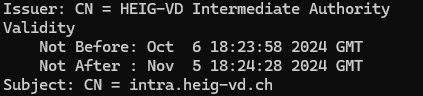
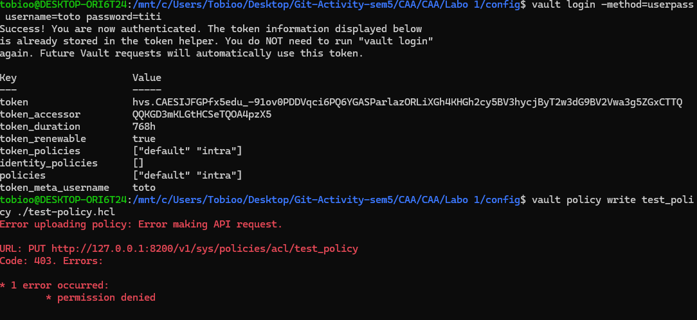

# Rapport CAA Labo 1

Auteurs : Harun Ouweis

## Introduction

Ce laboratoire a pour objectif de mettre en pratique les concepts de sécurité des systèmes informatiques en utilisant Vault, un outil de gestion de secrets développé par HashiCorp. Vault permet de stocker, gérer et distribuer des secrets, des clés de chiffrement et d'autres données sensibles de manière sécurisée. Ce rapport a pour unique but de répondre aux questions posées dans le document du laboratoire.

N.B. : Avant d'exécuter le script il faut lancer le serveur avec la config `config.hcl` fournie. Et si les clés ont déjà été initialisées, nous pouvons les supprimer automatiquement sous `./vault/data` puis à partir de cela, nous pouvons exécuter le script. Le script a été fait uniquement fonctionnel pour l'initialisation du point de départ, ensuite il est moins utile.

## 4 Starting the Vault server

### 4.1 What is the goal of the unseal process. Why are they more than one unsealing key?

L'objectif du processus de déverrouillage est de récupérer la clé principale (root key) en texte clair, nécessaire pour décrypter la clé de chiffrement utilisée pour protéger les données dans Vault. Ce processus permet d’accéder aux données sécurisées par Vault. En répartissant cette clé en plusieurs parts (unseal keys) selon le schéma de Shamir, Vault renforce la sécurité en évitant que l’accès aux données ne repose sur une seule personne ou une seule clé. Ainsi, plusieurs clés de déverrouillage sont nécessaires pour éviter qu'une seule personne ne puisse déverrouiller le système, réduisant ainsi les risques d'accès non autorisé si une clé est compromise.

### 4.2 What is a security officer. What do you do if one leaves the company?

Un security officer est chargé de superviser, gérer et surveiller les aspects liés à la sécurité du système. Cette personne est également responsable de manipuler les clés de déverrouillage et de participer à la gestion sécurisée de Vault.

S'il quitte l'entreprise et qu'il était en possession d'une des clés de déverrouillage, On doit obligatoirement générer de nouvelles parts de clés avec la commande `rekey` pour éviter toute compromission. Il est aussi recommandé de procéder à une rotation des clés de chiffrement pour s’assurer qu’elles ne sont pas accessibles par l’ancien employé. Enfin, tous les accès et les identifiants de l'ancien Security Officer doivent être révoqués dans l'ensemble des systèmes, y compris dans Vault.

## 5 Policies

RAS

## 6 PKI

### 6.1 Why is it recommended to store the root certificate private key outside of Vault (we did not do this here)?

Il est recommandé de stocker la clé privée du certificat racine en dehors de Vault, car Vault est un système connecté au réseau. Si la clé privée du certificat racine est stockée dans Vault, elle est potentiellement accessible depuis le réseau et pourrait être compromise en cas d'attaque. Si cette clé est compromise, tous les certificats émis par cette autorité ne peuvent plus être considérés comme fiables. En conservant la clé privée hors ligne, les risques de compromission via une attaque réseau sont considérablement réduits. Habituellement, un certificat intermédiaire est utilisé pour signer les certificats finaux, tandis que la clé privée de l'autorité racine est conservée hors ligne.

### 6.2 Where would you typically store the root certificate private key?

La clé privée du certificat racine est généralement stockée dans un Hardware Security Module (HSM). Un HSM est un dispositif physique sécurisé conçu pour générer, stocker et protéger des clés cryptographiques. En gardant cette clé dans un HSM, elle est protégée contre les attaques réseau et autres tentatives d'attaques Ce type de dispositif est souvent utilisé pour protéger les clés de certification critiques.

### 6.3 What do you need to do in Vault to store the root certificate private key outside of Vault?

Pour stocker la clé privée du certificat racine en dehors de Vault, il faut d'abord générer un ou plusieurs certificats intermédiaires qui serviront à signer les certificats finaux. La clé privée du certificat racine peut alors être retirée et conservée hors ligne après avoir signé ces certificats intermédiaires. Dans Vault, seules les clés des certificats intermédiaires seront conservées et utilisées pour signer les certificats finaux. Cela permet de minimiser l'exposition de la clé privée du certificat racine.

### 6.4 How is the intermediate certificate private key secured?

La clé privée du certificat intermédiaire est stockée dans Vault et est protégée par les mécanismes de chiffrement de Vault. Toutes les données dans Vault, y compris les clés privées, sont chiffrées tant que Vault est scellé. Une fois unsealed, Vault utilise les clés de déverrouillage pour accéder aux données chiffrées. Cela garantit que la clé privée du certificat intermédiaire n'est accessible qu'après que Vault a été correctement déverrouillé par un nombre suffisant de détenteurs des clés de déverrouillage.

### 6.5 In the certificate for intra.heig-vd.ch, what is its duration of validity? What is the name of its issuer?

La durée de validité du certificat pour intra.heig-vd.ch est de 30 jours, comme spécifié lors de sa génération. Cette durée est couramment choisie pour des certificats utilisés dans des environnements dynamiques ou lors de tests, afin de limiter l'exposition en cas de compromission. Le nom de son émetteur est "HEIG-VD Intermediate", qui correspond à l'autorité de certification intermédiaire créée et utilisée pour signer ce certificat.

### 6.6 What do you need to do concretely for the intra.heig-vd.ch certficate to be accepted by browsers?

Pour que le certificat de intra.heig-vd.ch soit accepté par les navigateurs, il faut installer le certificat racine de l'autorité de certification (Root CA) dans les navigateurs ou sur les machines clientes. Cela permet au navigateur de faire confiance à tous les certificats signés par cette autorité, y compris le certificat intermédiaire et les certificats finaux. De plus, il est nécessaire de configurer le serveur web pour qu'il fournisse la chaîne complète des certificats (de l'autorité intermédiaire au certificat final) lors de la connexion. Cela permet au navigateur de valider correctement le certificat.

### 6.7 What is a wildcard certificate? What are its advantages and disadvantages?

Un certificat wildcard est un certificat qui utilise le caractère générique `*` pour couvrir plusieurs sous-domaines d'un domaine donné. Par exemple, un certificat wildcard pour `*.heig-vd.ch` couvrira des sous-domaines comme `www.heig-vd.ch`, `mail.heig-vd.ch`, etc.

Avantages :

- Un seul certificat peut sécuriser plusieurs sous-domaines, ce qui simplifie la gestion des certificats.
- Il est moins coûteux d'obtenir un certificat wildcard que d'obtenir plusieurs certificats pour chaque sous-domaine.

Inconvénients :

- Si la clé privée du certificat wildcard est compromise, tous les sous-domaines couverts par ce certificat sont également compromis.
- Un certificat wildcard ne couvre que les sous-domaines de premier niveau (par exemple, `*.heig-vd.ch`, mais pas `*.subdomain.heig-vd.ch`).

## 7 Users

Screenshot de la tentative d'action avec le compte toto :

## 8 Final Questions

### 8.1 How is the root key and the encryption key used to secure Vault?

La root key est divisée en plusieurs parts (unseal keys) selon le schéma de Shamir. Une fois ces parts combinées, la root key est reconstituée pour déverrouiller Vault. La root key déverrouille la clé de chiffrement (encryption key), qui est ensuite utilisée pour chiffrer et déchiffrer toutes les données stockées dans Vault. En somme, la root key protège la clé de chiffrement, qui elle-même sécurise les données.

### 8.2 What is key rotation and when is it done?

La rotation des clés consiste à changer la clé de chiffrement utilisée pour sécuriser les données dans Vault. Cela peut être fait périodiquement pour minimiser les risques en cas de compromission de la clé actuelle. La rotation peut être configurée automatiquement selon des paramètres comme un intervalle de temps ou un nombre d'opérations cryptographiques effectuées avec la clé. Elle peut également être déclenchée manuellement en cas de doute.

### 8.3 What can you say about the confidentiality of data in the storage backend? How is it done?

La confidentialité des données dans le backend de stockage est assurée par le chiffrement automatique des données avant qu'elles ne soient stockées. Vault considère le backend de stockage comme non sécurisé par défaut. Ainsi, les données sont chiffrées à l'aide de l'algorithme AES-256-GCM avec un nonce de 96 bits, garantissant que même si quelqu'un accède au backend, les données restent inaccessibles sans la clé de déchiffrement.

### 8.4 What can you say about the security of Vault against an adversary that analyses the memory ofthe server that runs Vault?

Vault ne protège pas contre les attaques basées sur l'analyse de la mémoire du serveur. Si un attaquant est capable de lire l'état de la mémoire d'un serveur Vault en cours d'exécution, il pourrait accéder aux clés déchiffrées et aux données sensibles. Cette menace n'est pas couverte dans le modèle de sécurité de Vault, et des mesures supplémentaires, comme la protection physique et le durcissement du serveur, doivent être mises en place pour contrer ces attaques.
