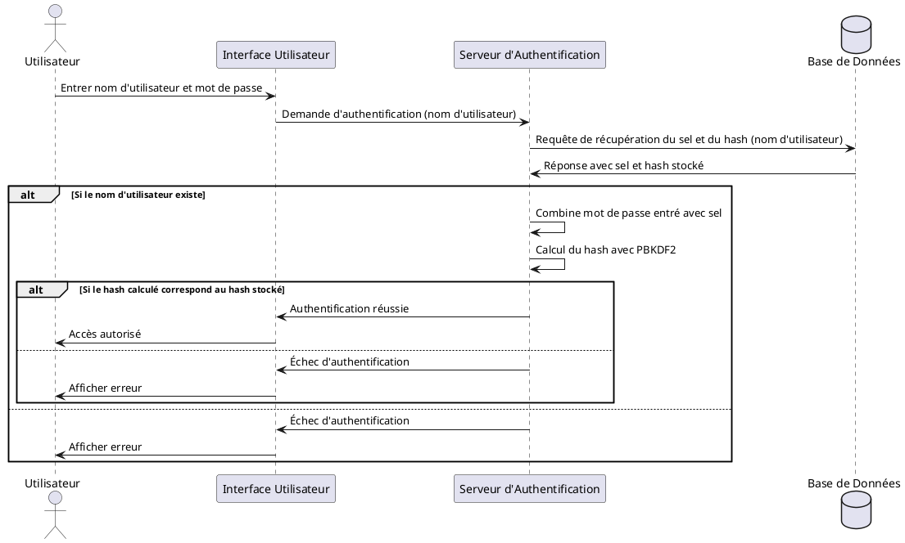
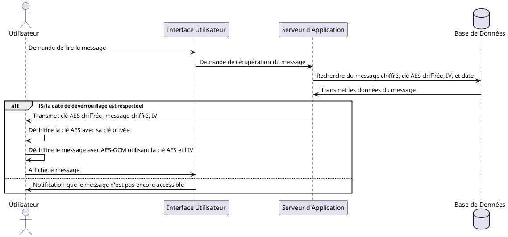
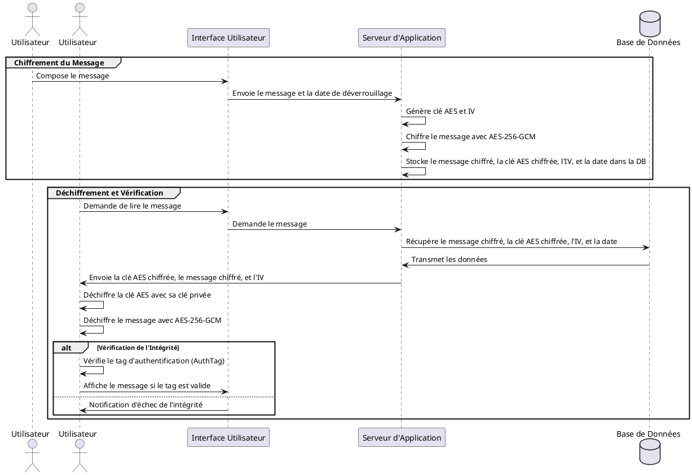
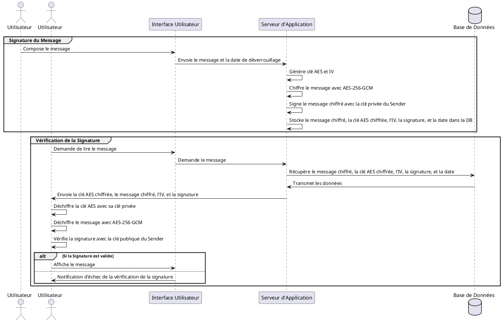
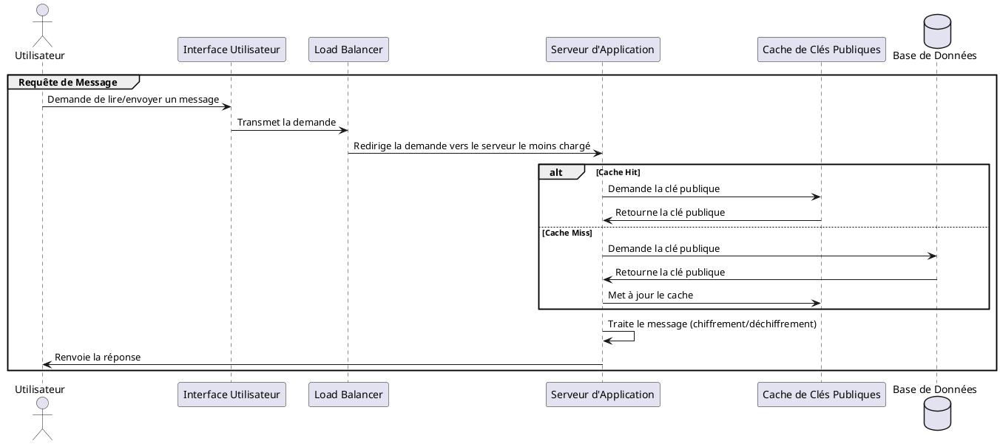
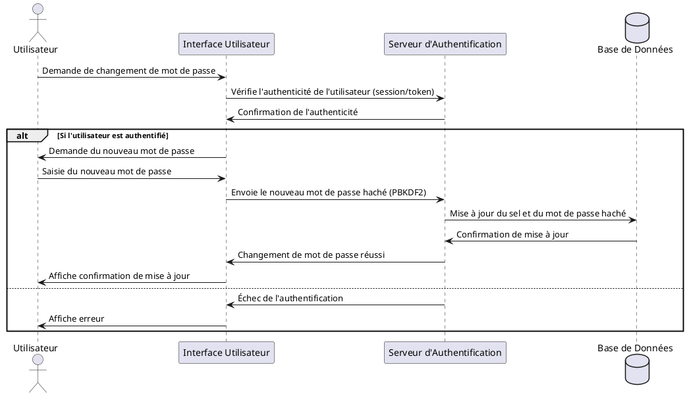
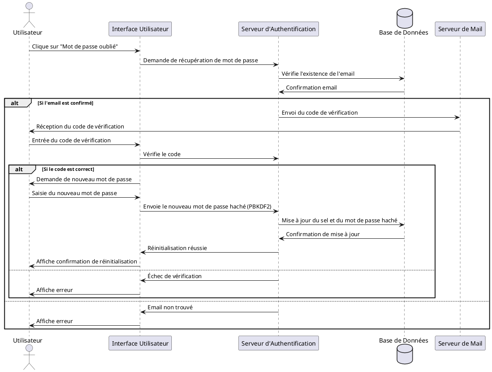
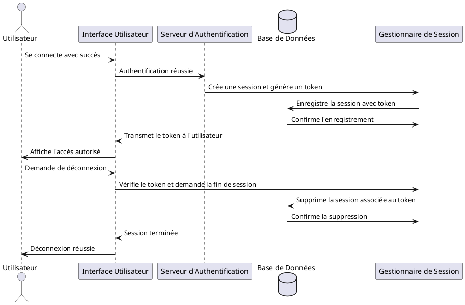
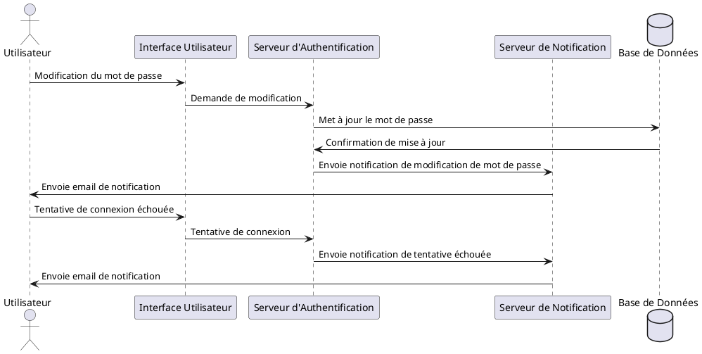

# Diagramme convo

## Diagrammes principaux

### Explications du Diagramme

- **Demande d'authentification** : L'interface utilisateur envoie seulement le nom d'utilisateur au serveur pour initier la demande d'authentification. Cela permet de récupérer le sel associé à l'utilisateur, ce qui est une pratique de sécurité pour éviter de révéler le mot de passe, même sous forme hachée, avant de s'assurer que l'utilisateur existe.
- **Calcul du hash avec PBKDF2** : Le serveur récupère le sel et le hash stocké de la base de données, puis combine le mot de passe fourni par l'utilisateur avec le sel pour recalculer le hash. Cette étape utilise PBKDF2, augmentant la sécurité contre les attaques par force brute grâce à une fonction de dérivation lente.

Excellent ! Passons à l'étape suivante du développement de ton projet, qui pourrait inclure la modélisation et la conception de la réception des messages, en nous concentrant sur le processus de déchiffrement et d'accès aux messages uniquement après la date spécifiée.

### Modélisation du Processus de Réception des Messages

Pour cette partie, nous allons créer un diagramme détaillant le flux cryptographique pour la réception et le déchiffrement des messages. Voici le scénario que nous envisagerons :

1. **Réception du Message Chiffré** : Le récepteur obtient un message qui contient le contenu chiffré, la clé AES chiffrée, l'IV, et la date de déverrouillage.
2. **Déchiffrement de la Clé AES** : À l'aide de sa clé privée, le récepteur déchiffre la clé AES.
3. **Déchiffrement du Message** : Une fois la clé AES récupérée, le récepteur utilise cette clé et l'IV pour déchiffrer le message.
4. **Vérification de la Date de Déverrouillage** : Le récepteur vérifie si la date actuelle permet de lire le message.
5. **Affichage du Message** : Si la date le permet, le message est affiché à l'utilisateur.

### Création du Diagramme PlantUML pour la Réception des Messages

Voici le diagramme PlantUML qui décrit le processus de réception et de déchiffrement des messages :

Parfait, nous allons maintenant aborder la manière dont nous assurons la confidentialité et l'intégrité des messages dans ton système de messagerie sécurisé. Je vais structurer cela à travers un diagramme PlantUML qui montre les étapes cryptographiques impliquées pour garantir que les messages restent confidentiels et intacts pendant leur stockage et leur transmission.

### Objectifs de Confidentialité et Intégrité

1. **Confidentialité** : S'assurer que seul le destinataire prévu peut lire le contenu du message.
2. **Intégrité** : Vérifier que le message n'a pas été altéré depuis son envoi par l'expéditeur.

### Scénario de Fonctionnement

- **Chiffrement** : Utilisation d'AES-256-GCM pour le chiffrement symétrique des messages, garantissant la confidentialité.
- **Authentification** : L'utilisation de GCM (Galois/Counter Mode) fournit une authentification des messages, ce qui garantit que tout changement dans les données ou dans l'ordre des messages sera détecté.

### Diagramme PlantUML de la Confidentialité et de l'Intégrité des Messages

### Discussion

Ce diagramme illustre non seulement le processus de chiffrement pour sécuriser les messages contre les accès non autorisés, mais également le processus de déchiffrement et de vérification de l'intégrité, assurant que les messages n'ont pas été modifiés. Le tag d'authentification généré par le mode GCM permet de vérifier l'intégrité du message lors du déchiffrement.

Si ce diagramme capture bien les exigences de confidentialité et d'intégrité pour ton projet, nous pouvons l'intégrer dans le rapport final. Sinon, je suis prêt à effectuer les ajustements nécessaires pour mieux répondre à tes attentes.

Pour la non-répudiation, nous allons mettre en place un mécanisme qui garantit que l'expéditeur d'un message ne peut pas nier avoir envoyé ce message. Cela implique l'utilisation de signatures numériques. Voici comment nous pouvons modéliser ce processus avec un diagramme PlantUML, en mettant l'accent sur les aspects cryptographiques spécifiques qui facilitent la non-répudiation dans le système de messagerie.

### Objectifs de Non-Répudiation

1. **Signature Numérique** : Chaque message envoyé doit être signé par une clé privée de l'expéditeur, garantissant l'authenticité et la provenance du message.
2. **Validation de la Signature** : Le destinataire doit pouvoir vérifier la signature à l'aide de la clé publique de l'expéditeur pour confirmer que le message a bien été envoyé par celui-ci et n'a pas été modifié.

### Scénario de Fonctionnement

- **Signature** : Avant d'envoyer un message, l'expéditeur le signe avec sa clé privée.
- **Vérification** : À la réception, le destinataire utilise la clé publique de l'expéditeur pour vérifier la signature et confirmer l'authenticité du message.

### Diagramme PlantUML de la Non-Répudiation

### Discussion

Ce diagramme illustre clairement le processus de signature et de vérification, essentiels pour assurer la non-répudiation. En signant le message chiffré, l'expéditeur garantit que toute modification ultérieure du message invalidera la signature. Le destinataire peut ainsi vérifier l'authenticité et l'intégrité du message à l'aide de la signature numérique.

Pour aborder la scalabilité et les performances de ton système de messagerie, nous devons envisager comment gérer efficacement un grand nombre d'utilisateurs et de transactions tout en maintenant de hauts niveaux de performance et de sécurité. Voici comment nous pouvons modéliser ces aspects avec un diagramme PlantUML, en mettant en évidence les technologies et stratégies clés qui facilitent la scalabilité et les performances.

### Objectifs de Scalabilité et de Performance

1. **Gestion Efficace des Ressources** : Optimiser l'utilisation des ressources serveur pour traiter un grand nombre de requêtes simultanées sans dégradation significative des performances.
2. **Caching des Clés Publiques** : Utiliser des mécanismes de mise en cache pour réduire la charge sur la base de données et accélérer l'accès aux informations fréquemment requises, comme les clés publiques.

### Scénario de Fonctionnement

- **Balance de Charge** : Utiliser des techniques de balance de charge pour distribuer les requêtes entrantes entre plusieurs serveurs ou instances.
- **Caching** : Mettre en cache les données fréquemment accédées, telles que les clés publiques, pour réduire la latence et le nombre de requêtes à la base de données.
- **Optimisation des Requêtes** : Minimiser le coût des requêtes de base de données par des indexations appropriées et des requêtes optimisées.

### Diagramme PlantUML de la Scalabilité et des Performances

### Discussion

Ce diagramme démontre le flux de traitement d'un message, de la demande de l'utilisateur jusqu'à la réponse, en passant par le système de balance de charge et l'utilisation d'un cache pour les clés publiques. Le "Load Balancer" sert à distribuer équitablement la charge entre plusieurs serveurs, tandis que le cache de clés publiques aide à réduire la charge sur la base de données et à accélérer le traitement des requêtes.

Le caching est particulièrement crucial pour les opérations qui nécessitent un accès rapide à des données spécifiques, comme la vérification des clés publiques lors du chiffrement ou du déchiffrement des messages. Cela est d'autant plus important que le nombre d'utilisateurs augmente, car cela permet d'éviter les goulets d'étranglement qui pourraient autrement survenir avec des accès répétés à la base de données.

---

## Catégorie seconde

### Fonctionnalité : Changement de Mot de Passe

Ce processus doit permettre à l'utilisateur de modifier son mot de passe de manière sécurisée. Il impliquera la vérification de l'identité de l'utilisateur avant de permettre la modification du mot de passe. Voici les étapes principales :

1. **Vérification de l'Utilisateur** : Assurer que l'utilisateur qui demande le changement de mot de passe est bien celui qu'il prétend être.
2. **Génération du Nouveau Mot de Passe** : Permettre à l'utilisateur de saisir un nouveau mot de passe.
3. **Mise à jour Sécurisée du Mot de Passe** : Appliquer des mesures cryptographiques pour mettre à jour le mot de passe de manière sécurisée dans la base de données.

### Création du Diagramme PlantUML pour le Changement de Mot de Passe

Voici le diagramme PlantUML qui illustre le processus de changement de mot de passe :

Pour continuer à développer notre suite de diagrammes pour le système, la prochaine étape importante est la gestion des mots de passe oubliés. Ce processus est crucial pour assurer que les utilisateurs peuvent récupérer l'accès à leur compte de manière sécurisée en cas d'oubli de leur mot de passe.

### Fonctionnalité : Récupération de Mot de Passe

Cette fonctionnalité doit permettre aux utilisateurs de réinitialiser leur mot de passe de façon sécurisée en validant leur identité à travers un mécanisme de vérification, comme l'envoi d'un code de vérification à leur adresse email enregistrée.

1. **Demande de Réinitialisation** : L'utilisateur indique qu'il a oublié son mot de passe et demande une réinitialisation.
2. **Vérification de l'Identité** : Envoyer un code de vérification à l'email associé au compte pour confirmer l'identité de l'utilisateur.
3. **Réinitialisation du Mot de Passe** : Permettre à l'utilisateur de saisir un nouveau mot de passe une fois le code de vérification entré correctement.

### Création du Diagramme PlantUML pour la Récupération de Mot de Passe

Voici le diagramme PlantUML illustrant le processus de récupération de mot de passe :

Continuons sur notre lancée en abordant maintenant la fonctionnalité de gestion des sessions utilisateur, qui est essentielle pour assurer la sécurité et la gestion appropriée des sessions actives après que les utilisateurs se soient connectés à leur compte. Cette fonctionnalité permet de surveiller et de contrôler l'accès aux ressources de l'application, assurant que les utilisateurs sont correctement authentifiés et autorisés pendant leurs interactions avec le système.

### Fonctionnalité : Gestion des Sessions Utilisateur

Cette fonctionnalité inclut la création, le maintien, et la terminaison des sessions utilisateur pour sécuriser l'accès après l'authentification initiale.

1. **Création de la Session** : Initier une session après une authentification réussie.
2. **Maintien de la Session** : Utiliser des jetons de session (tokens) pour maintenir l'état de connexion de l'utilisateur à travers les interactions avec l'application.
3. **Terminaison de la Session** : Permettre aux utilisateurs de se déconnecter explicitement et invalider la session pour prévenir l'accès non autorisé.

### Création du Diagramme PlantUML pour la Gestion des Sessions

Voici le diagramme PlantUML illustrant le processus de gestion des sessions utilisateur :

Passons maintenant à une fonctionnalité critique pour la sécurité et l'expérience utilisateur : la notification de sécurité. Cela peut inclure des alertes envoyées aux utilisateurs en cas de tentatives de connexion suspectes ou de changements importants dans la configuration de leur compte. Cela aide à maintenir les utilisateurs informés de l'activité sur leur compte et renforce la sécurité en permettant une réaction rapide à toute activité non autorisée.

### Fonctionnalité : Notifications de Sécurité

Cette fonctionnalité doit permettre de notifier les utilisateurs de divers événements de sécurité, tels que des tentatives de connexion échouées ou des modifications sensibles de leurs paramètres de compte.

1. **Déclenchement des Notifications** : Identifier les événements qui nécessitent une notification, comme des modifications de mot de passe, des connexions depuis de nouveaux appareils, ou des tentatives de connexion échouées.
2. **Envoi des Notifications** : Envoyer des notifications via un canal approprié, tel que l'email ou une notification push mobile.
3. **Gestion des Préférences de Notification** : Permettre aux utilisateurs de configurer leurs préférences de notification pour choisir les types d'alertes qu'ils souhaitent recevoir.

### Création du Diagramme PlantUML pour les Notifications de Sécurité

Voici le diagramme PlantUML illustrant le processus de gestion et d'envoi des notifications de sécurité :

### Discussion

Ce diagramme détaille les interactions entre l'utilisateur, l'interface utilisateur, le serveur d'authentification, et le serveur de notification pour les deux scénarios : la modification du mot de passe et les tentatives de connexion échouées. Les notifications sont envoyées pour informer l'utilisateur de l'activité critique, renforçant ainsi la sécurité du compte.

Ce flux contribue à améliorer la transparence et la réactivité face aux activités suspectes ou importantes sur le compte de l'utilisateur. Si ce diagramme est conforme à tes attentes, nous pouvons l'intégrer dans ton rapport. Sinon, n'hésite pas à demander des modifications ou des ajustements pour l'adapter parfaitement à tes besoins.
